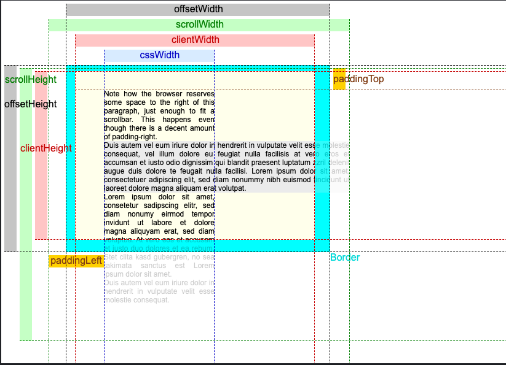

### css框模型之offset/client/scroll -width/height的dom属性🐶
---

先放一张图

再放个网址 http://jsfiddle.net/y8Y32/25/ （图实时效果）

- offsetWidth，offsetHeight：包含所有边框的可视框大小。当元素`display:block`,可以通过添加`width`,`height`,`paddings`,`边框`来计算 「在图里是灰色」
- clientWidth，clientHeight：框内容的可视部分，不包括边框和滚动条，但是包括`padding`。不能直接从css计算，取决于系统的滚动条大小。 「在图里是红色」
- scrollWidth，scrollHeight：框的所有内容的大小，包括当前隐藏在滚动区域之外的部分。不能直接从css计算，取决于内容.「在图里是绿色」